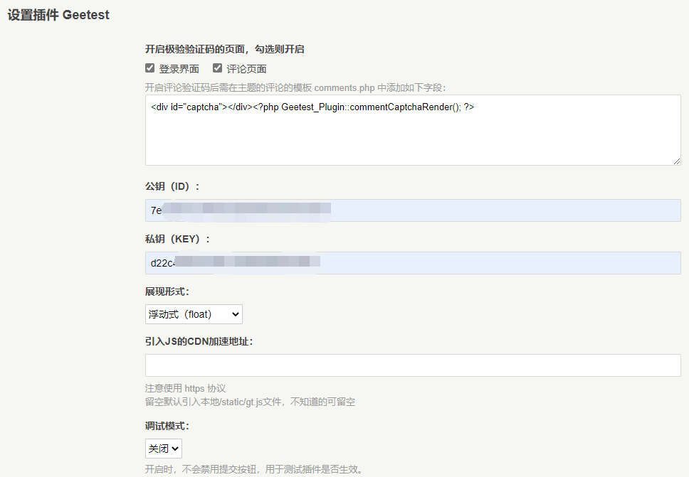

## Geetest for Typecho

极验验证插件，用于用户登录、用户评论时使用极验提供的滑动验证码，适配了Material主题

### 更新说明
保留原插件的登陆验证功能，新增评论验证功能

### 使用方法

下载插件后，解压，将文件夹名称改为 Geetest，上传到 /usr/plugins 目录下，在插件面板启用插件并配置即可使用；

极验验证码的 ID 和 KEY 需要到极验官网（https://www.geetest.com/）注册、创建应用获取，基础版是免费的；

### Thanks

@zhb127
@xueshanlinghu 
