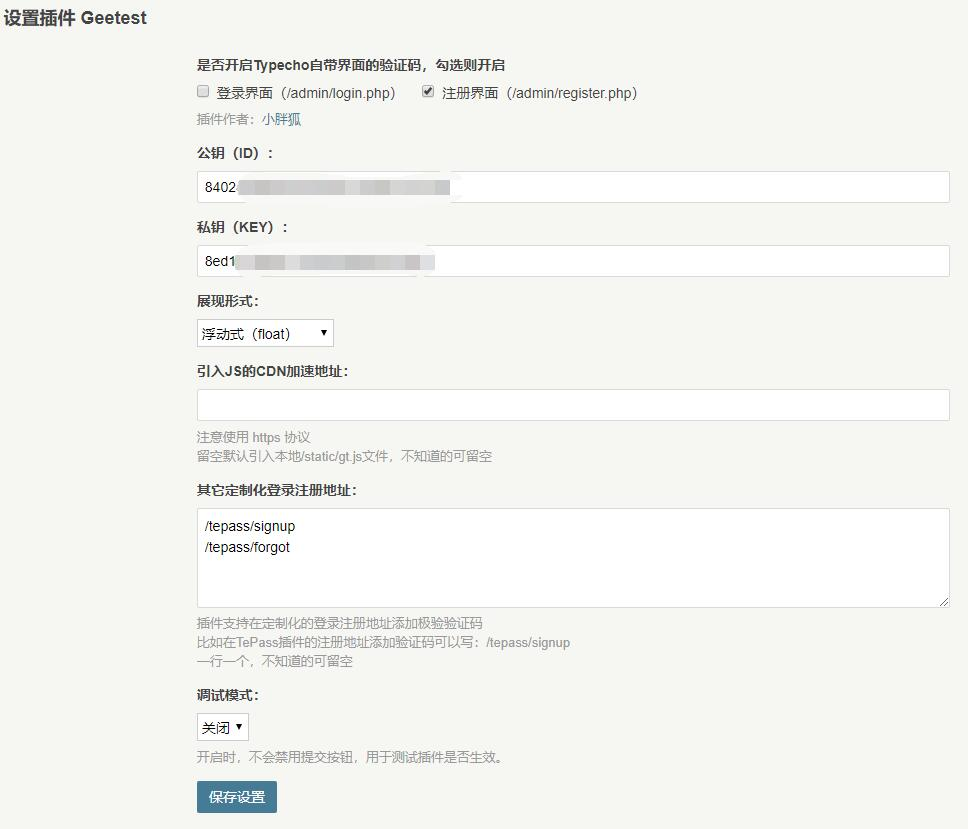

## Geetest for Typecho

极验验证插件，用于用户登录、注册，支持定制化的注册登录页面也添加验证码如 TePass 插件。

### 插件起源

Typecho 本身自带的不支持验证码登录或者注册这个大家都知道，我个人比较想给注册部分加上一下验证码，防止恶意注册。使用极验验证码是个好主意，基础版的少量使用，是免费接入的（我之前不知道，近些天注册了个号才知道）。于是尝试了目前市面上各种 Typecho 的 Geetest 插件，发现都不尽如人意。

使用插件时我有两方面的考虑：

1. 希望不需要修改主题或者 Typecho 原来的文件目录的文件，通过插件的内容即可添加验证码，这样以后不用验证码了，禁用插件就行。
2. 希望根据自己的情况，可以出现在需要验证码的地方，如注册页面。也能支持定制化的登录注册页面，比如我用了 TePass 插件，是自带登录、密码找回和注册的单独的页面的，但是截止目前 TePass 本身不支持，以后可能支持吧，问了作者暂时没对此有所回应，所以得找别的插件支持了。

看了目前我能找到的各种极验插件，主要是测试 [TE 插件仓库](https://github.com/typecho-fans/plugins)的，发现没有能满足我所有的需求的，于是就考虑能否自己写一个了。正好看到别人写的某个能实现登录界面加验证码的插件，测试了可以用，就默默开始了插件改造之旅。虽然我的 PHP 水平真的不怎么样，但还是大致依葫芦画瓢搞出来了。当然，不排除有更好的写法或者有那么万一的 bug，如果你发现的话，欢迎提 Issue 告知，我会妥善处理哒。

我应该会长期用起来 Typecho，所以本插件应该也会长期保证有问题的维护的，谢谢大家！

### 插件支持的功能

- [x] 支持控制 Typecho 自带的登录、注册页面是否开启极验验证码，可以全部关闭或开启或选择其中某个界面开启（新增功能）
- [x] 支持配置不同的极验验证码展现形式（原版自带）
- [x] 支持引入 JS 的 CDN 加速（原版自带）
- [x] 支持其它定制化登录注册地址，如果你想在其他你想要的页面添加极验验证码通过才能提交，可以自定义配置多个界面。确定兼容 TePass 插件自带的登录、找回密码和注册等页面（因为我就是为了那个开发的）（新增功能）

### 使用方法

下载插件后，解压，注意文件夹名称要为 Geetest 才可以，上传到 /usr/plugins 目录下，在插件面板启用插件并配置即可使用。

极验验证码的 ID 和 KEY 需要到[极验官网](https://www.geetest.com/)去注册和创建应用获取，反正我用基础版，是免费的。

其他都是很简单的填写方法，我给个范例图给大家，基本没啥好说的，如有问题，到我[官网作品发布页](http://zsduo.com/archives/56.html)给我留言即可，也可以提 Issue 处理。

### 特别鸣谢

特别感谢插件原来的代码作者：@zhb127，TE 插件仓库名：菠菜。我是在他之前的 1.0.0 的版本基础上做的进一步优化修改和功能添加，在此表示深深的感谢！
